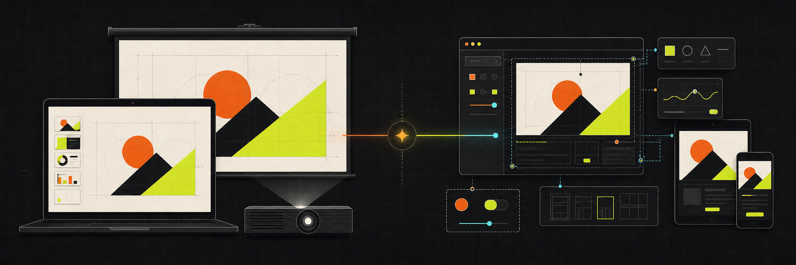

  

# Awesome Skills Index

**公开 Agent Skills 的索引与传播入口**

Skill 的代码、Issue、安装和后续更新以 [`github.com/awesome-skills`](https://github.com/awesome-skills) 组织下的独立仓库为准

## Featured Skills

| Skill | 解决什么问题 | 安装 |
|---|---|---|
| [**create-html-deck**](https://github.com/awesome-skills/create-html-deck) | 创建并验证适用于笔记本和投影的浏览器原生演示文稿 | `npx skills@latest add awesome-skills/create-html-deck -g -y` |
| [**design-artifact**](https://github.com/awesome-skills/design-artifact) | 创建并验证高保真交互 HTML Artifact 与响应式原型 | `npx skills@latest add awesome-skills/design-artifact -g -y` |

## 两个 Skill 怎么选

| | Create HTML Deck | Design Artifact |
|---|---|---|
| 主要产物 | 周会分享、技术演讲、浏览器 PPT | Landing page、交互原型、产品 Mockup |
| 布局模型 | 1920×1080 固定画布，按视口缩放 | 响应式页面或应用布局 |
| 主要操作 | 翻页、演讲、投屏 | 滚动、表单、筛选和状态切换 |
| 重点验证 | 14 英寸 MacBook、常见笔记本、1080p 投影 | 目标视口、窄屏、主路径和关键状态 |

需要“第几页”和演讲节奏时选择 [create-html-deck](https://github.com/awesome-skills/create-html-deck)；需要滚动、点击和状态变化时选择 [design-artifact](https://github.com/awesome-skills/design-artifact)

## 在线案例

[**▶ 别让一个线程从需求聊到代码写完**](https://verifiable-goal-weekly-share-public.pages.dev)

这份 15 页 HTML 周会分享由 `create-html-deck` 工作流制作，并实际检查了 MacBook 与投影视口

## Canonical Source

这个仓库只维护索引，不再保存 Skill 代码副本。请从组织仓库安装、提交 Issue、查看 README 或参与维护：

- [`awesome-skills/create-html-deck`](https://github.com/awesome-skills/create-html-deck)
- [`awesome-skills/design-artifact`](https://github.com/awesome-skills/design-artifact)
- [浏览 Awesome Skills 组织的全部仓库](https://github.com/awesome-skills)
